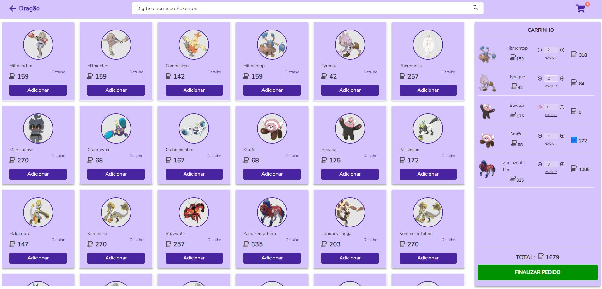
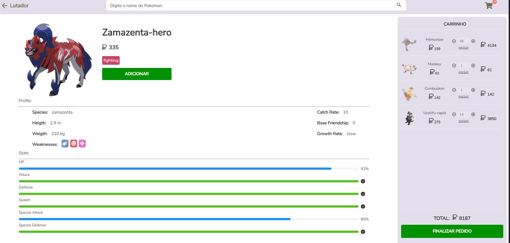

<h2 align="center">PokeStore<h2>

Site hospedado [PokeStore](https://poke-store-web-app.netlify.app/)

<h3 align="center" fontSize="60px">
 PokeStore - plataforma de lojas pokémons
</h3>

<p align="center">
  
</p>

<p align="center">
  
</p>

## 💻 Projeto

Desenvolver uma aplicação web onde é possivel acessar as lojas, listagem e visualização de pokémons, adiciona-los ao carrinho de compra, excluir, adicionar mais ou diminuir, ver detalhe, finalizar compra e voltar para tela principal de seleção de loja.

Para a construção deste projeto foi usado ReactJS com TypeScript. Todos os dados sobre os pokémons como nome, número, tipo, imagem e entre outras coisas, foram possíveis com o uso da API REST [PokéApi](https://pokeapi.co/).

### Funcionalidades

- [x] **Listagem de lojas**: Listar as lojas pokémons.

- [x] **Listagem dos pokémons**: Listar os pokémons com o uso da API REST.

- [x] **listagem de acordo com o tipo de pokémons**: Método para mostrar somente pokemons referente aos seus respectivos tipos.

- [x] **Buscar pokémons**: Método para filtrar os pokémons a partir do seu nome.

- [x] **Manter em cache as informações ao atualizar a tela**: Tanto na listagem quanto no carrinho foi adicionar o metodo para manter os dados salvos em localStorage.

- [x] **Adicionar pokémons ao carrinho de compras**: Botão para adicionar os pokémons ao carrinho de compras e regra criado para impedir dados duplicados, modificando apenas a quantidade desejada

- [x] **Filtro de pokemons em lista**: Criado a regra de negocio para filtar pokemons que ainda estão no carrinho ao trocar de loja. Para mais informações foi criado um icone de carrinho no header com um badge de informações sobre a quantidade que ainda está no carrinho.

- [x] **Criação da pagina de descrição**: Separar as informações do pokémon como status, profile, habilidades e estatísticas.

- [x] **Carrinho em tela**: O carrinho aparece em ambas as telas e o processo de adição e exclusão.

- [x] **Respansividade**: A aplicação é respanssivel, portanto, irá funcionar e adpatar-se em qualquer resolução de tela: web, tablet e mobile até 375px.

- [x] **Exclusão**: Ao excluir pokemon é exibida em tela um modal de menssagem se realmente o usuário deseja excluir o pokemon do carrinho.

- [x] **Subtrair quantidade**: É possivel adicionar ou subtrair pokémons do carrinho, porém se o mesmo tiver quantidade subtraida abaixo de zero o sistema bloqueia a subtração de mais quantidades.

- [x] **Finalizar pedido**: Ao finalizar o pedido é exibido em tela um modal animado e a menssagem de pedido finalizado e em seguida o usuário é redirecionado novamente para a tela principal de seleção de lojas

### Conceitos abordados

- Uso de flexbox para alinhar e ajustar elementos na página.

- Consumo de api com o uso da lib [axios](https://github.com/axios/axios).

- Conceitos de tipagem no typescript.

- Uso do conceito de função recursiva para criar gatilhos e regras para execução do processo.

- Controle de listagens repetidas, exclusão e edição na posição.

- respansividade e controle da tela de carrinho.

- Criando tema global de cores com o `DefaultTheme` do [styled-components](https://www.styled-components.com/).

## 💻 Tecnologias

- ✔️ [React](https://pt-br.reactjs.org/)
- ✔️ [Styled-components](https://www.styled-components.com/)
- ✔️ [Ant.design(Modal, Layout, Progress)](https://ant.design/components/overview/)
- ✔️ [Sweetalert](https://sweetalert2.github.io/)
- ✔️ [Polished](https://polished.js.org/docs/)
- ✔️ [React-Icons](https://react-icons.netlify.com/)
- ✔️ [Axios](https://github.com/axios/axios)
- ✔️ [React Router Doom](https://reactrouter.com/web/guides/quick-start)
- ✔️ [TypeScript](https://www.typescriptlang.org/)

## 📥 Instalação e execução

Faça um clone desse repositório e acesse o diretório.

```bash
$ git clone https://github.com/CharlesPereira1/pokeStore.git && cd pokeStore
```

```bash
# Instalando as dependências
$ yarn

# Executanto aplicação
$ yarn dev

```

## 👋 Contribuir

Faça o `fork` e clone o projeto a partir do seu usuário.

```bash
# Clonando projeto
$ git clone https://github.com/SEU-NOME-DE-USUARIO/pokeStore.git

# Criando um branch
$ git branch minha-alteracao

# Acessando o novo branch
$ git checkout -b minha-alteracao

# Adicionando os arquivos alterados
$ git add .

# Criando commit e a mensagem
$ git commit -m "Corrigindo...."

# Enviando alterações para o brach
$ git push origin minha-alteracao
```

Você deve navegar até o seu repositório onde fez o fork e clicar no botão _New pull request_ no lado esquerdo da página.

## 📝 Licença

Feito por Charles Pereira 👋 &nbsp;[linkedin](https://www.linkedin.com/in/charlespereira1/) | [Github](https://github.com/CharlesPereira1)
